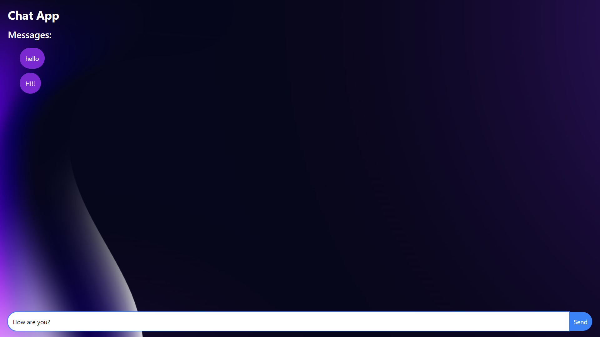

# Chat Application

This is a simple chat application built using Node.js, Express, and Socket.IO. The application allows users to send and receive messages in real-time.

## Features
-   **Real-time Messaging**: Users can send and receive messages instantly.All users connected to the chat room will receive the message in real-time.
-   **Responsive Design**: The application is styled using Tailwind CSS for a responsive and modern look.

## Prerequisites

-   Node.js
-   npm (Node Package Manager)

## Installation

1. **Clone the repository**:

    ```sh
    git clone https://github.com/hitansh-thakur/chat-app.git
    cd chat-app
    ```

2. **Install dependencies**:

    ```sh
    npm install
    ```

<!-- npm run dev for client and nodemon for server -->
3. **Go to Client Directory**:

    ```sh
    cd client
    npm install
    npm run dev
    ```
4. **Go to Server Directory**:

    ```sh
    cd server
    npm install
    nodemon
    ```

5. **Open your browser**:

    The application should now be running at `http://localhost:5173`.

## Screenshots



## Author

-   [Hitansh Thakur]("https://github.com/hitansh-thakur")

## License

Distributed under the MIT License. See `LICENSE` for more information.
